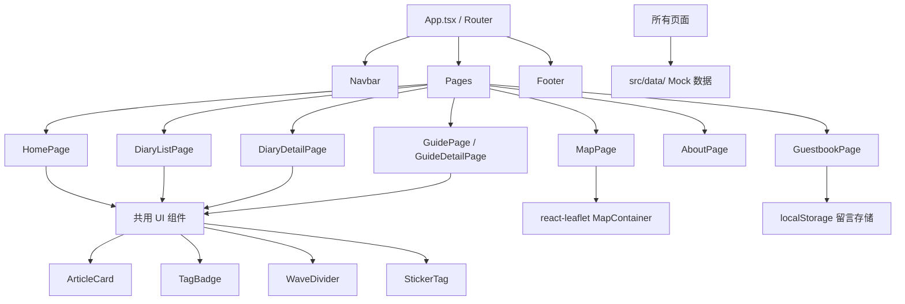

## 用户需求

### 产品定位

一个以"日系治愈风"为视觉基调的个人旅行分享博客网站，以旅行故事 + 实用攻略为核心内容，配合可爱卡通的视觉语言，打造有温度、有个性的旅行记录平台。

### 产品概览

网站包含完整的博客功能闭环：首页展示精选内容、旅行日记时间线、目的地攻略分类浏览、交互式旅行地图、关于我页面、以及读者留言板。内容数据通过静态 Mock 数据内置（先实现页面完整样式与交互，后期可替换为 CMS 接口）。

### 核心功能

- **首页**：个人简介 Banner + 精选旅行卡片 + 最新文章列表 + 旅行地图入口，顶部导航 + 底部版权
- **旅行日记**：文章列表页（卡片网格 + 标签筛选 + 搜索）+ 文章详情页（行程信息、每日路线、美食、花费清单、照片墙）
- **目的地攻略**：按城市/国家分类展示，攻略卡片含封面图、标签、摘要，点击进入详情
- **旅行地图**：基于地图组件，在地点打点，点击气泡跳转对应文章
- **关于我**：个人介绍、旅行偏好、装备清单、社交联系方式
- **留言板**：留言列表展示 + 留言提交表单（昵称、头像选择、内容）

### 视觉效果

- 日系治愈风：奶油色大背景、粉色/薄荷蓝/奶油黄三色点缀
- 卡片圆角（rounded-2xl 以上）、软阴影、手绘插画感插图
- 标签做成贴纸形态（色块 + 圆角 + 轻微旋转）
- 波浪形 SVG 区域分割线
- 按钮/卡片有轻微弹跳 hover 动效（scale + shadow）
- 字体：圆润标题字体 + 高可读正文字体

## 技术栈

| 层次 | 选型 |
| --- | --- |
| 框架 | React 18 + TypeScript |
| 路由 | React Router v6 |
| 样式 | Tailwind CSS v3 |
| UI 组件 | shadcn/ui（基础组件） |
| 地图 | react-leaflet（轻量开源地图） |
| 动效 | Framer Motion（卡片入场/弹跳动效） |
| 数据 | 本地 TypeScript Mock 数据（JSON 结构） |
| 构建 | Vite |


> 选择 Vite + React 而非 Next.js：无需 SSR/SSG，页面内容为静态 Mock 数据，Vite 启动更快、配置更简单，适合快速落地展示型博客。后期如需 SEO 可平滑迁移至 Next.js。

---

## 实现策略

### 整体架构

- **单页应用（SPA）**，React Router v6 管理 6 大页面路由
- **数据层**：`src/data/` 目录下统一存放 Mock 数据（文章、攻略、留言、地图点位），组件通过 import 直接消费，结构与未来 CMS API 保持一致，方便替换
- **组件层**：共用 UI 组件（Card、Tag、WaveDivider、Navbar、Footer）提取至 `src/components/ui/`，页面级组件在 `src/pages/` 下
- **样式层**：Tailwind CSS 实现整体布局，关键动效用 Framer Motion，波浪分割线用内联 SVG 组件

### 关键设计决策

1. **卡通视觉系统**：在 `tailwind.config.ts` 中扩展主题色（粉/薄荷/奶油黄/奶油白），统一复用，避免魔法值散落各处
2. **地图组件**：使用 `react-leaflet` + OpenStreetMap（免费、无需 API Key），每篇文章携带经纬度字段，地图页读取所有文章的坐标渲染 Marker
3. **留言板**：纯前端实现，留言数据存入 `localStorage`，实现"发送后立即展示"的真实感交互
4. **响应式**：移动优先，Tailwind 断点 `sm/md/lg` 处理卡片列数切换

### 性能要点

- 图片全部使用 `loading="lazy"` + 固定宽高比占位，避免布局抖动
- 地图组件懒加载（`React.lazy + Suspense`），不影响首屏速度
- Framer Motion 仅在卡片可视区触发动画（`whileInView`），避免首屏阻塞

---

## 架构设计



---

## 目录结构

```
project-root/
├── index.html
├── vite.config.ts                    # [NEW] Vite 配置，路径别名 @/
├── tailwind.config.ts                # [NEW] 扩展主题色：粉色/薄荷蓝/奶油黄/奶油白
├── src/
│   ├── main.tsx                      # [NEW] 入口，挂载 App
│   ├── App.tsx                       # [NEW] Router 配置，6 大路由
│   ├── data/
│   │   ├── diaries.ts                # [NEW] 旅行日记 Mock 数据（含经纬度、标签、每日路线、照片）
│   │   ├── guides.ts                 # [NEW] 目的地攻略 Mock 数据
│   │   └── mapPoints.ts              # [NEW] 地图打点数据（从 diaries 聚合导出）
│   ├── types/
│   │   └── index.ts                  # [NEW] Diary、Guide、GuestMessage、MapPoint 类型定义
│   ├── components/
│   │   ├── layout/
│   │   │   ├── Navbar.tsx            # [NEW] 顶部导航：Logo + 5 个导航项，移动端汉堡菜单
│   │   │   └── Footer.tsx            # [NEW] 底部版权 + 社交图标
│   │   └── ui/
│   │       ├── ArticleCard.tsx       # [NEW] 通用文章卡片（封面图/标题/摘要/标签/日期），hover 弹跳动效
│   │       ├── TagBadge.tsx          # [NEW] 贴纸风格标签（色块 + 圆角 + 轻微旋转）
│   │       ├── WaveDivider.tsx       # [NEW] 波浪 SVG 分割线组件，支持颜色 prop
│   │       ├── SearchBar.tsx         # [NEW] 搜索输入框，圆角 + 放大镜图标
│   │       └── PhotoWall.tsx         # [NEW] 照片墙：响应式瀑布流/网格，点击放大预览
│   └── pages/
│       ├── HomePage.tsx              # [NEW] 首页：Hero Banner + 精选文章卡片 + 最新日记 + 地图入口
│       ├── DiaryListPage.tsx         # [NEW] 日记列表：卡片网格 + 标签筛选 + 关键词搜索
│       ├── DiaryDetailPage.tsx       # [NEW] 日记详情：行程信息头部 + 每日路线 + 美食/Tips + 照片墙
│       ├── GuidePage.tsx             # [NEW] 攻略列表：按目的地分组展示攻略卡片
│       ├── GuideDetailPage.tsx       # [NEW] 攻略详情：结构化攻略内容（交通/住宿/美食/花费）
│       ├── MapPage.tsx               # [NEW] 旅行地图：react-leaflet 地图 + 自定义可爱 Marker + 文章弹窗
│       ├── AboutPage.tsx             # [NEW] 关于我：头像 + 个人故事 + 旅行偏好标签 + 装备卡片
│       └── GuestbookPage.tsx         # [NEW] 留言板：留言列表（气泡样式）+ 留言提交表单
```

## 设计风格

**日系治愈卡通风**：整体以奶油暖白为大背景，粉色作为主视觉色（按钮、标题装饰、重要标签），薄荷蓝与奶油黄作为辅助点缀色，营造清甜、温柔、治愈的整体氛围。

排版上大量使用圆角（卡片 rounded-2xl、按钮 rounded-full），卡片配备软阴影（shadow-md），hover 时轻微放大（scale-105）并加深阴影，模拟"拿起贴纸"的触感反馈。

波浪形 SVG 线条分隔各页面区块，标签以"贴纸"形态呈现（色块背景 + 极小角度旋转）。首页 Hero 区域配手绘风插画背景元素（云朵、小星星、飞机图标 SVG）。

## 页面规划（6 屏）

### 1. 首页 HomePage

- **顶部导航栏**：Logo（可爱字体 + 飞机图标）+ 导航链接（日记/攻略/地图/关于/留言），粉色下划线激活态
- **Hero Banner**：全宽渐变背景（粉→奶油），大标题 + 副标题 + "开始探索"按钮，右侧手绘风旅行插画
- **波浪分割线**：奶油色→白色过渡
- **精选旅行卡片**：标题"精选旅行" + 3 列大图卡片（封面图/目的地/摘要/标签），Framer Motion 卡片入场
- **最新日记**：横向滚动卡片列表，每张卡片含日期贴纸
- **地图入口 Banner**：薄荷蓝背景 + "查看我的旅行地图"大按钮 + 小地图预览图
- **底部版权**：粉色细线分割 + 社交图标

### 2. 旅行日记列表 DiaryListPage

- **页面标题区**：插画装饰标题"旅行日记" + 文章数量统计
- **筛选工具栏**：搜索框 + 标签筛选贴纸列（可多选，选中态粉色高亮）
- **文章卡片网格**：3 列响应式，卡片含封面/标题/日期/预算/标签，hover 弹跳
- **分页控件**：圆形页码按钮，粉色激活态

### 3. 日记详情 DiaryDetailPage

- **文章头图**：全宽封面大图 + 渐变遮罩 + 白色标题/目的地/日期覆盖
- **行程信息卡片**：横排信息条（出发日期/天数/人均/交通），薄荷蓝背景
- **每日路线**：Timeline 竖向时间线（Day 1/2/3），每节含小地图截图 + 文字描述
- **美食与Tips**：两栏布局，左侧美食卡片列表（小图+名称+评分），右侧 Tips 气泡卡片
- **花费清单**：表格式清单，品类图标 + 金额，底部合计高亮
- **照片墙**：瀑布流网格，点击弹出全屏预览 Modal
- **底部导航**：上一篇/下一篇文章卡片

### 4. 旅行地图 MapPage

- **页面标题**："我去过的地方" + 打卡城市数统计
- **全屏地图区**：react-leaflet 地图，自定义粉色圆形 Marker，点击弹出可爱气泡卡片（文章封面缩略图+标题+前往按钮）
- **侧边打卡列表**：右侧折叠面板，滚动列出所有打卡城市及文章链接
- **地图底部**：薄荷蓝条幅统计（国家数/城市数/文章数）

### 5. 关于我 AboutPage

- **头像区**：圆形大头像（带粉色圆圈边框）+ 昵称 + 一句话介绍
- **旅行故事**：图文混排，手绘风插画点缀段落
- **旅行偏好标签云**：贴纸标签云（背包客/美食控/城市探索等）
- **装备卡片**：3 列装备卡片（相机/背包/登山鞋等），含图标+名称+简介
- **联系方式**：社交平台图标按钮（微博/小红书/Instagram）

### 6. 留言板 GuestbookPage

- **页面标题**：手绘风黑板背景 + 粉笔字标题"来留言吧"
- **留言气泡列表**：聊天气泡样式，左右交错排列，含用户昵称/头像选择/时间/内容
- **留言表单**：昵称输入 + 可爱表情/头像选择器（emoji 列表）+ 留言内容 textarea + 提交按钮（粉色圆角，点击有弹跳动效）
- **底部**：鼓励性小文案 + 星星装饰